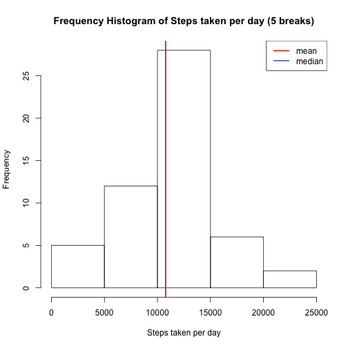
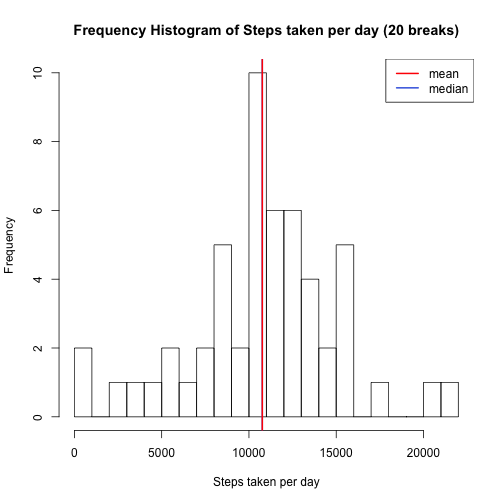
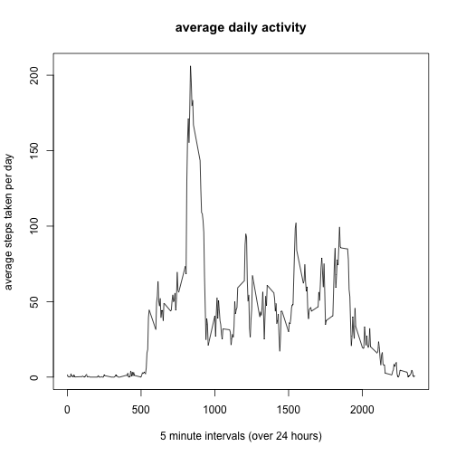
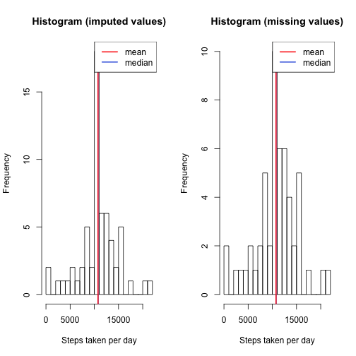
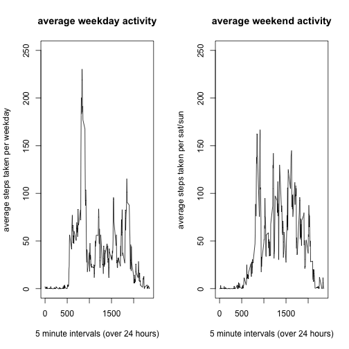

---
title: 'Reproducible Research [Coursera]: Assignment 1'
author: "Hasintha Attanayake"
date: "16 June 2016"
output: html_document
---    
**The following document consists of secondary headings as dictated by the assignment instructions and tertiary headings for subdivisions of assigned tasks**  

## Loading and preprocessing the data  
### Loading the raw data  

The file 'activity.csv' (within activity.zip) should be located within main repository / working directory of R markdown file and will be imported into the work environment using **read.csv()** after being unziped.


```r
unzip("activity.zip")
activity <- read.csv('activity.csv', header = TRUE)
```

### Preprocessing the raw data  

The raw dataframe *activity* will be simplified by removing all **NA** values with the **na.omit** function. (missing values ignored) 


```r
activity_processed <- na.omit(activity)  
```

*For the following two parts of the assingment the preprocessed simplified data is used*

## What is mean total number of steps taken per day?

**1. Calculate the total number of steps taken each day**

Analysis for this section will be performed using the **plyr** package in R and the **ddply()** function to split, apply **mean()** function and recombine/summarise the data set. A small sample of the data set is previewed using the **head()** function.


```r
library(plyr)
summary_steps <- ddply(activity_processed,.(date),summarise, total_steps_per_day = sum(steps))
head(summary_steps)
```

```
##         date total_steps_per_day
## 1 2012-10-02                 126
## 2 2012-10-03               11352
## 3 2012-10-04               12116
## 4 2012-10-05               13294
## 5 2012-10-06               15420
## 6 2012-10-07               11015
```

**2. Make a histogram of the total number of steps taken each day**

Plotted using basic function with breaks (size bins) in the frequency histogram of 5 and 20 for comparison.  

**5 size bins:**


```r
hist(summary_steps$total_steps_per_day, breaks = 5, xlab = "Steps taken per day", main ="Frequency Histogram of Steps taken per day (5 breaks)")
abline(v = median(summary_steps$total_steps_per_day),col = "royalblue", lwd = 2)
abline(v = mean(summary_steps$total_steps_per_day),col = "red", lwd = 2)
legend(x = "topright", c("mean","median"), col = c("red","royalblue"), lwd = c(2,2))
```

 

**20 size bins:**  


```r
hist(summary_steps$total_steps_per_day, breaks = 20, xlab = "Steps taken per day", main ="Frequency Histogram of Steps taken per day (20 breaks)")
abline(v = median(summary_steps$total_steps_per_day),col = "royalblue", lwd = 2)
abline(v = mean(summary_steps$total_steps_per_day),col = "red", lwd = 2)
legend(x = "topright", c("mean","median"), col = c("red","royalblue"), lwd = c(2,2))
```

 

**3. Calculate and report the mean and median of the total number of steps taken per day**

Simply done using the **mean()** and **median()** functions applied to the *steps_taken_per_day* column of the *summary_steps* dataframe. 


```r
mean_steps <- mean(summary_steps$total_steps_per_day)
median_steps <- median(summary_steps$total_steps_per_day)
```

```r
mean_steps
```

```
## [1] 10766.19
```

```r
median_steps
```

```
## [1] 10765
```

**Validation for mean:**  
Simple validation of mean using preprocessed data (not raw). Total steps determined by using **sum()** function on *steps* column in the *activitysimple* dataframe.Total days calculated by applying **unique()** and **length** fuctions to the *date* column in the *activity_processed* dataframe. Mean steps per day is equal to total steps divided by total day.s.


```r
total_steps <- sum(activity_processed$steps)
total_days <- length(unique(activity_processed$date)) 
validated_mean <- total_steps/total_days
```

```r
validated_mean 
```

```
## [1] 10766.19
```
## What is the average daily activity pattern?

**1. Make a time series plot (i.e. type = "l") of the 5-minute interval (x-axis) and the average number of steps taken, averaged across all days (y-axis)**

First we will create a new binded data set using the **plyr** package and the **ddply()** function to create an average based upon each 5 minute increment. A sample of this data is shown below. N.B we have already previously loaded this package so there is no need to do it again. 


```r
summary_interval <- ddply(activity_processed,.(interval),summarise,mean_steps_per_interval = mean(steps)) 
head(summary_interval)
```

```
##   interval mean_steps_per_interval
## 1        0               1.7169811
## 2        5               0.3396226
## 3       10               0.1320755
## 4       15               0.1509434
## 5       20               0.0754717
## 6       25               2.0943396
```

```r
summary_interval <- as.data.frame(summary_interval)
```


Now we will proceed to plot a timeseries (type = l) plot for average steps per time period using the **base** package


```r
plot(summary_interval,type="l",xlab = "5 minute intervals (over 24 hours)", ylab = "average steps taken per day", main = "average daily activity")
```

 

**2. Which 5-minute interval, on average across all the days in the dataset, contains the maximum number of steps?**

**max** function is applied on *summary_interval* data frame to extract row with highest average steps per day.


```r
maximum_step <- max(summary_interval[,2])
maximum_interval <- summary_interval[summary_interval$mean_steps_per_interval==maximum_step,]
maximum_interval
```

```
##     interval mean_steps_per_interval
## 104      835                206.1698
```

## Imputing missing values

**1. Calculate and report the total number of missing values in the dataset (i.e. the total number of rows with $$\color{red}{\verb|NA|}$$s) **

Using **sum()** and **is.na()** functions of dataset prior to preprocessing. 2304 NA's in the original data set.


```r
sum(is.na(activity))
```

```
## [1] 2304
```

**2. Devise a strategy for filling in all of the missing values in the dataset. The strategy does not need to be sophisticated. For example, you could use the mean/median for that day, or the mean for that 5-minute interval, etc. **

For simplicity we will use the average values for 5 minute intervals since we have already calculated this data.

**3. Create a new dataset that is equal to the original dataset but with the missing data filled in. **


```r
activity_imputed <- activity

activity_imputed$steps[is.na(activity_imputed$steps)] <- summary_interval$mean_steps_per_interval[match(activity_imputed$interval,summary_interval$interval)][is.na(activity_imputed$steps)]
```

Validate new data set *activity_imputed* contains no NA's:

```r
sum(is.na(activity_imputed))
```

```
## [1] 0
```
**4. Make a histogram of the total number of steps taken each day and Calculate and report the mean and median total number of steps taken per day. Do these values differ from the estimates from the first part of the assignment? What is the impact of imputing missing data on the estimates of the total daily number of steps?**

Create mean by day data set for *activity_imputed*:


```r
summary_steps_imputed <- ddply(activity_imputed,.(date),summarise, total_steps_per_day = sum(steps))
head(summary_steps_imputed)
```

```
##         date total_steps_per_day
## 1 2012-10-01            10766.19
## 2 2012-10-02              126.00
## 3 2012-10-03            11352.00
## 4 2012-10-04            12116.00
## 5 2012-10-05            13294.00
## 6 2012-10-06            15420.00
```

Plot graphs as done previous (side by side) with 20 breaks shown for both graphs: 


```r
par(mfrow = c(1,2))

hist(summary_steps_imputed$total_steps_per_day, breaks = 20, xlab = "Steps taken per day", main ="Histogram (imputed values)")
abline(v = median(summary_steps_imputed$total_steps_per_day),col = "royalblue", lwd = 2)
abline(v = mean(summary_steps_imputed$total_steps_per_day),col = "red", lwd = 2)
legend(x = "topright", c("mean","median"), col = c("red","royalblue"), lwd = c(2,2))

hist(summary_steps$total_steps_per_day, breaks = 20, xlab = "Steps taken per day", main ="Histogram (missing values)")
abline(v = median(summary_steps$total_steps_per_day),col = "royalblue", lwd = 2)
abline(v = mean(summary_steps$total_steps_per_day),col = "red", lwd = 2)
legend(x = "topright", c("mean","median"), col = c("red","royalblue"), lwd = c(2,2))
```

 
Difference in mean of the old and new data sets (new - old): 

```r
mean(summary_steps_imputed$total_steps_per_day) - mean(summary_steps$total_steps_per_day)
```

```
## [1] 0
```
Difference in median of the old and new data sets (new-old):

```r
median(summary_steps_imputed$total_steps_per_day) - median(summary_steps$total_steps_per_day)
```

```
## [1] 1.188679
```
Summary: no impact on mean minimal impact on median. 

##Are there differences in activity patterns between weekdays and weekends?

N.B imputed data set based of *activity_imputed* used for this section.

**1. Create a new factor variable in the dataset with two levels – “weekday” and “weekend” indicating whether a given date is a weekday or weekend day.**

Factors are created for weekdays and weekends: 

```r
activity_imputed$wd <- weekdays(as.Date(activity_imputed$date))
activity_imputed$fwd <- as.factor(c("weekend", "weekday"))
activity_imputed[activity_imputed$wd == "Sunday" | activity_imputed$wd == "Saturday" ,5]<- factor("weekend")
activity_imputed[!(activity_imputed$wd == "Sunday" | activity_imputed$wd == "Saturday"),5 ]<- factor("weekday")
```
Divide data into usable subsets for weekends and weekdays specifically taking the mean per interval for the two factors:


```r
activity_imputed_we <- subset(activity_imputed, fwd == "weekend") 
summary_interval_we <- ddply(activity_imputed_we,.(interval),summarise,mean_steps_per_interval = mean(steps)) 

activity_imputed_wd <- subset(activity_imputed, fwd == "weekday") 
summary_interval_wd <- ddply(activity_imputed_wd,.(interval),summarise,mean_steps_per_interval = mean(steps)) 
```

**2.Make a panel plot containing a time series plot (i.e. $$\color{red}{\verb|type = "l"|}$$) of the 5-minute interval (x-axis) and the average number of steps taken, averaged across all weekday days or weekend days (y-axis). See the README file in the GitHub repository to see an example of what this plot should look like using simulated data.**

Plotted using **base** system:


```r
par(mfrow = c(1,2))

plot(summary_interval_wd,type="l",xlab = "5 minute intervals (over 24 hours)", ylab = "average steps taken per weekday", main = "average weekday activity", ylim=c(0,250))

plot(summary_interval_we,type="l",xlab = "5 minute intervals (over 24 hours)", ylab = "average steps taken per sat/sun", main = "average weekend activity",ylim=c(0,250))
```

 

Comments: as observed the individual the data was taken from wakes earlier during weekdays but after an initial step spike (getting to work perhaps) the number of steps taken per interval is less sustained in comparison to weekends. The individual also most likely sleeps later on weekends as indicated by the graph. 
